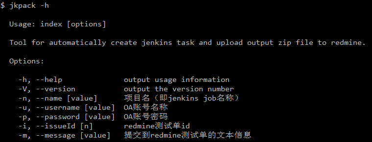
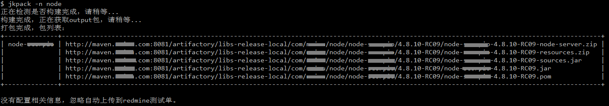
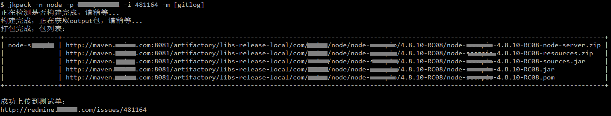

# jkpack

自动触发jenkins系统打包并搜集生成到artifactory的包，告别手工操作。

## 安装

``` bash
$ npm install -g jkpack
```

## 配置

``` bash
$ jkpack -h
```




## 使用

注意：pack工具的使用时机是**完成开发、提交代码并且已经成功merge之后。**

参数说明：

`name`：jenkins job名称，必填的

`password`：OA账号的密码，如果不需要自动提交到redmine测试单，可以不填

`issueId`：redmine测试单id，如果不需要自动提交到redmine测试单，可以不填

`message`：提交到redmine的说明，如果填写`[gitlog]`则自动从git提交记录获取最新commit提交


- 启动项目构建（只生成构建结果）：

``` bash
$ jkpack -n node
```



- 构建并自动提交到redmine测试单：

``` bash
$ jkpack -n node -i 474193 -p [Your OA password] -m test
```




如果觉得参数复杂也可以将参数写到名为`.jkpack.json`的配置文件中，存放在项目根目录即可：

`.jkpack.json`配置示例：

``` bash
{
    "name": "node",
    "issueId": 474193,
    "password": "[Your OA password]",
    "message": "[gitlog]"
}
```

`password`这一项不推荐写到配置里，运行`jkpack`命令时输入即可。

## Licence

MIT.
